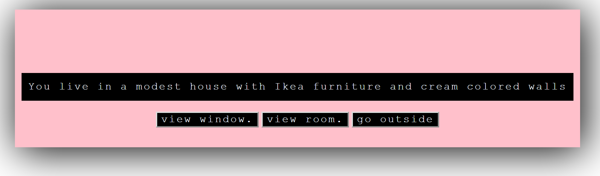
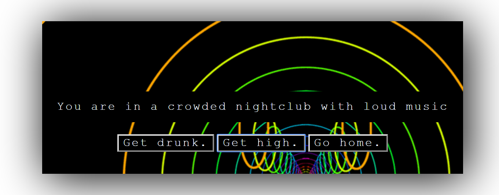
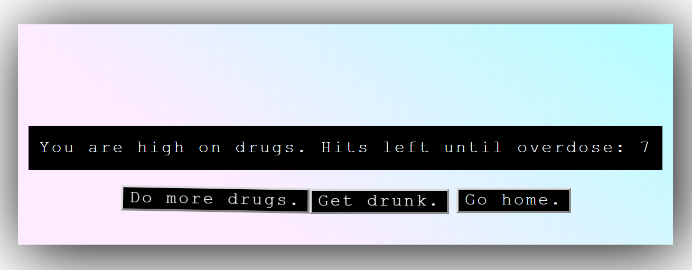

# week_three
## TEXT ADVENTURE IN JS!

Welcome to my segment in the third week of theClubhouse code bootcamp. This week's project was focused on javascript. I made life simulator text adeventure game.

# Make choices and live life. 
You can experiment with drugs, alcohol and relationships. You'll notice that if you do more drugs the buttons begin to shake rapidly. If you get drunk the buttons will move around. This increases your chance of killing a random person just like in real life. I hope you enjoy my game. The live demo is here:
[Live demo](https://evangertis.github.io/week_three/)
